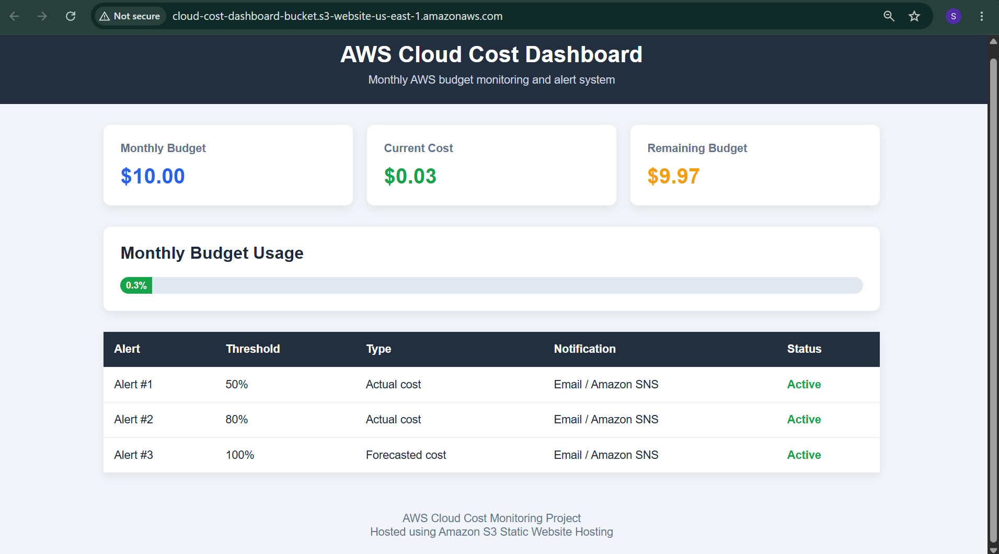
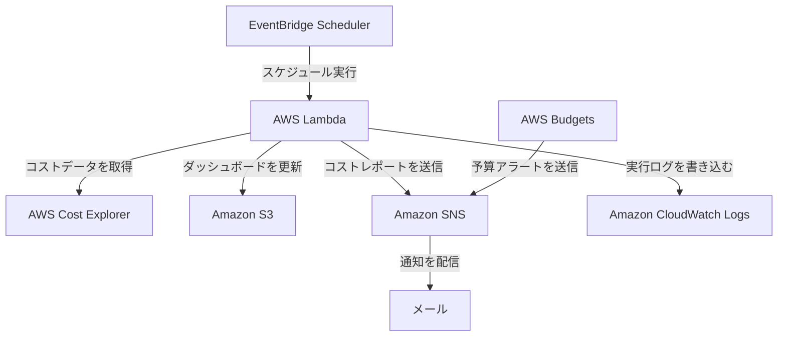
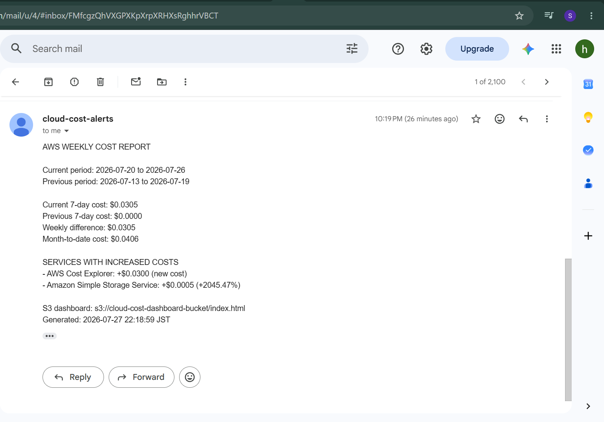
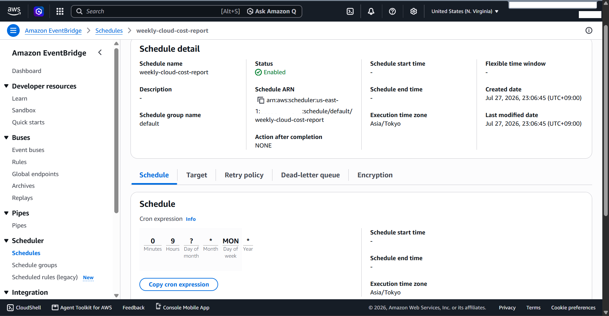
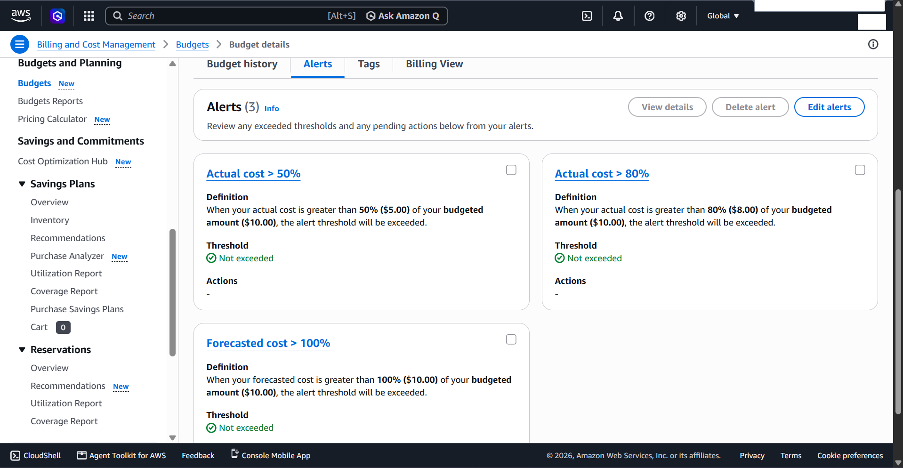
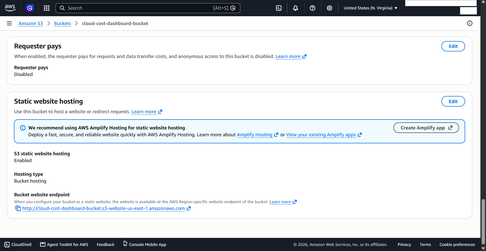

# AWS クラウドコスト監視・アラートシステム

[English](README.md)

AWS Cost Explorer を使って利用料金を分析し、Amazon S3 に静的 HTML ダッシュボードを公開し、Amazon SNS を通して毎週メールレポートを送る、自動 AWS コスト監視システムです。

## ダッシュボードのプレビュー



## プロジェクト概要

請求データを手動で確認する場合、予想していなかったクラウド料金を見つけることは難しいです。このプロジェクトは、レポート作成を自動化し、最近のコスト変化を簡単に確認できるようにします。

Lambda 関数は、次の処理を行います。

1. AWS サービスごとに、非ブレンドコスト（Unblended Cost）を取得します。
2. 完了した直近7日間と、その前の7日間を比較します。
3. 月初から現在までのコストを計算し、利用料金が増えたサービスを見つけます。
4. HTML ダッシュボードを作成し、Amazon S3 にアップロードします。
5. 毎週の概要を SNS トピックに送信します。

AWS Budgets は、月間予算の 50%、80%、100% に達したとき、別々のアラートを送ります。

## アーキテクチャ

次の図は、Cloud Cost Monitoring System の自動ワークフローとデータの流れを示しています。
システム全体のアーキテクチャ、各コンポーネントの連携、データの流れについては、別のドキュメントで説明しています。



[詳しいアーキテクチャ資料を見る](architecture/README.ja.md)

## 使用した AWS サービス

| サービス | このプロジェクトでの役割 |
| --- | --- |
| AWS Cost Explorer | 指定した期間の利用料金を、AWSサービスごとに取得します |
| AWS Lambda | 利用料金のデータを整理し、HTMLダッシュボードと週次レポートを作成します |
| Amazon S3 | 作成したHTMLダッシュボードを保存し、Web上で表示します |
| Amazon SNS | 週次レポートと予算に関する通知をメールで送信します |
| Amazon EventBridge Scheduler | 毎週、決められた時間にLambda関数を自動で実行します |
| AWS Budgets | 月間予算の利用状況を確認し、使用率が50％、80％、100％を超えたときに通知します |
| Amazon CloudWatch Logs | Lambdaの実行記録を保存し、動作状況やエラーを確認するために使用します |
| AWS Identity and Access Management（IAM） | LambdaやSchedulerに、必要な操作だけを許可します |


## リポジトリ構成

```text
cloud-cost-monitoring-system/
├── README.md
├── README.ja.md
├── LICENSE
├── .gitignore
├── architecture/
│   ├── README.md
│   ├── README.ja.md
│   ├── architecture-diagram.png
│   └── architecture-diagram.svg
├── lambda/
│   ├── lambda_function.py
│   ├── README.md
│   └── README.ja.md
├── iam/
│   ├── cloud-cost-monitor-application-policy.json
│   ├── cloud-cost-dashboard-s3-upload.json
│   ├── eventbridge-scheduler-invoke-lambda-policy.json
│   ├── eventbridge-scheduler-trust-policy.json
│   ├── README.md
│   └── README.ja.md
├── eventbridge/
│   ├── schedule-configuration.md
│   └── schedule-configuration.ja.md
├── dashboard/
│   └── index.html
└── screenshots/
    ├── budgets/
    │   ├── budget-alert-sns-integration.png
    │   ├── budget-alert-thresholds.png
    │   └── budget-overview.png
    ├── dashboard/
    │   ├── cloud-cost-dashboard-overview.png
    │   └── service-cost-comparison.png
    ├── eventbridge/
    │   ├── eventbridge-lambda-target.png
    │   └── eventbridge-schedule.png
    ├── iam/
    │   ├── cost-explorer-sns-permissions.png
    │   ├── iam-role-permission-policies.png
    │   └── s3-putobject-least-privilege.png
    ├── lambda/
    │   ├── cloudwatch-lambda-success-logs.png
    │   ├── lambda-function-permissions.png
    │   └── lambda-test-success.png
    ├── s3/
    │   ├── cloud-cost-dashboard.png
    │   ├── dashboard-object.png
    │   └── static-website-hosting.png
    └── sns/
        ├── sns-access-policy-1.png
        ├── sns-access-policy-2.png
        ├── sns-email-subscription-confirmed.png
        ├── sns-subscription-confirmed.png
        ├── sns-test-notification-email.png
        └── sns-weekly-cost-report-email.png
```

## 設定

### Lambda

- 関数名：`cloud-cost-report-generator`
- ランタイム：Python 3.x
- ハンドラー：`lambda_function.lambda_handler`
- アーキテクチャ：`arm64`
- リージョン：`us-east-1`
- 推奨タイムアウト：30秒

環境変数：

| 変数 | 例 | 必須 |
| --- | --- | --- |
| `S3_BUCKET_NAME` | `your-dashboard-bucket` | はい |
| `SNS_TOPIC_ARN` | `arn:aws:sns:us-east-1:ACCOUNT_ID:cloud-cost-alerts` | メールレポートを送る場合は必要 |
| `DASHBOARD_OBJECT_KEY` | `index.html` | いいえ。初期値は `index.html` |
| `SEND_WEEKLY_EMAIL` | `true` | いいえ。初期値は `true` |

実際のアカウント ID、メールアドレス、機密情報を含むリソース識別子をコミットしないでください。

### EventBridge Scheduler

- スケジュール名：`weekly-cloud-cost-report`
- スケジュールの種類：cron を使った繰り返しスケジュール
- タイムゾーン：`Asia/Tokyo`
- フレキシブルタイムウィンドウ：オフ
- ターゲット：`cloud-cost-report-generator`
- 完了後のアクション：なし
- 実行ロール：ターゲット関数だけに `lambda:InvokeFunction` を許可するロール

毎週月曜日の午前9時（日本時間）に実行する例：

```text
cron(0 9 ? * MON *)
```

### 必要な IAM 権限

Lambda 実行ロールには、次の権限が必要です。

- `ce:GetCostAndUsage`
- ダッシュボードオブジェクトに対する `s3:PutObject`
- 選んだ SNS トピックに対する `sns:Publish`
- `AWSLambdaBasicExecutionRole` によって設定される CloudWatch Logs の権限

できるだけ `*` を使わず、S3 と SNS の権限をこのプロジェクトのリソースだけに制限してください。

## デプロイ手順

1. Cost Explorer を有効にし、ダッシュボード用の S3 バケットを作成します。
2. SNS トピックを作成し、メールサブスクリプションを確認します。
3. 必要な権限を持つ Lambda 実行ロールを作成します。
4. Lambda 関数を作成し、`lambda/lambda_function.py` をアップロードして、環境変数を設定します。
5. 手動テストを実行し、S3 に `index.html` が作成されたことを確認します。
6. Lambda 関数をターゲットにする EventBridge Scheduler のスケジュールを作成します。
7. AWS Budget を作成し、アラートを SNS トピックに接続します。
8. CloudWatch Logs でスケジュール実行を確認し、毎週のメールが届いたことを確認します。

## 実行結果

### 自動送信された毎週のメール



### EventBridge のスケジュール



### 予算のしきい値



### S3 静的ウェブサイトホスティング



その他の設定結果は、`screenshots/` の中にある各サービスのフォルダーで確認できます。

## 動作確認

- Lambda の手動実行が正常に完了しました。
- Cost Explorer から、現在、過去、月初から現在までのコストデータを取得できました。
- 作成したダッシュボードを S3 にアップロードできました。
- EventBridge Scheduler から Lambda 関数を実行できました。
- SNS から毎週のコストレポートをメールで送信できました。
- AWS Budgets に 50%、80%、100% のしきい値を設定しました。

## セキュリティに関する注意点と今後の改善

このプロジェクトでは、デモンストレーションのために S3 の静的ウェブサイトホスティングを使用しています。本番環境では、プライベート S3 バケットの前に、Origin Access Control を設定した Amazon CloudFront を置く必要があります。その他の改善点には、Infrastructure as Code、SNS のデッドレター対策、Lambda が失敗したときの CloudWatch アラーム、自動テスト、コスト異常検出などがあります。

## このプロジェクトで示したスキル

AWS サーバーレスアーキテクチャ、コスト管理、IAM の最小権限、イベント駆動型の自動化、Python と Boto3、監視、トラブルシューティング、技術ドキュメント作成。

## ライセンス

このプロジェクトは [MIT License](LICENSE) で公開しています。学習とポートフォリオでの紹介を目的として作成しました。
