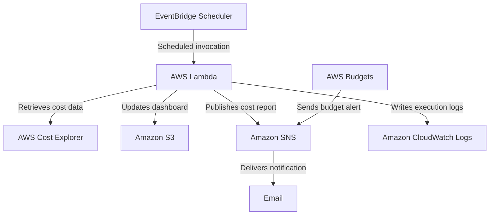

# AWS Cloud Cost Monitoring and Alert System

[日本語版](README.ja.md)

An automated AWS cost-monitoring solution that analyzes spending with AWS Cost Explorer, publishes a static HTML dashboard to Amazon S3, and delivers a weekly email report through Amazon SNS.

## Dashboard Preview


## Project Overview

Unexpected cloud charges can be difficult to detect when billing data is checked manually. This project automates the reporting process and makes recent cost changes easier to review.

This project was built and tested for learning purposes. The AWS resources used for testing have since been deleted.

The Lambda function:

1. Retrieves unblended costs grouped by AWS service.
2. Compares the latest seven completed days with the preceding seven days.
3. Calculates the month-to-date cost and identifies services with increased spending.
4. Generates an HTML dashboard and uploads it to Amazon S3.
5. Publishes a weekly summary to an SNS topic.

AWS Budgets sends alerts when actual spending exceeds 50% or 80% of the monthly budget, or when forecasted spending exceeds 100%.

## Architecture

The following diagram illustrates the automated workflow and data flow of the Cloud Cost Monitoring System.
The complete system architecture, component interactions, and data flow are documented separately.



[View detailed architecture documentation](architecture/README.md)

## AWS Services Used

| Service | Role in This Project |
| --- | --- |
| AWS Cost Explorer | Retrieves AWS service costs for a specified period |
| AWS Lambda | Processes cost data and generates the HTML dashboard and weekly report |
| Amazon S3 | Stores the generated HTML dashboard and makes it available on the web |
| Amazon SNS | Sends weekly reports and budget notifications by email |
| Amazon EventBridge Scheduler | Automatically invokes the Lambda function at a scheduled time every week |
| AWS Budgets | Monitors monthly budget usage and sends notifications when usage exceeds 50%, 80%, or 100% |
| Amazon CloudWatch Logs | Stores Lambda execution logs for checking system activity and errors |
| AWS Identity and Access Management (IAM) | Grants Lambda and EventBridge Scheduler only the permissions required for their tasks |

## Repository Structure

```text
cloud-cost-monitoring-system/
├── README.md
├── README.ja.md
├── LICENSE
├── .gitignore
├── architecture/
│   ├── README.md
│   ├── README.ja.md
│   ├── architecture-diagram.png
│   └── architecture-diagram.svg
├── lambda/
│   ├── lambda_function.py
│   ├── README.md
│   └── README.ja.md
├── iam/
│   ├── cloud-cost-monitor-application-policy.json
│   ├── cloud-cost-dashboard-s3-upload.json
│   ├── eventbridge-scheduler-invoke-lambda-policy.json
│   ├── eventbridge-scheduler-trust-policy.json
│   ├── README.md
│   └── README.ja.md
├── eventbridge/
│   ├── schedule-configuration.md
│   └── schedule-configuration.ja.md
├── dashboard/
│   └── index.html
└── screenshots/
    ├── budgets/
    │   ├── budget-alert-sns-integration.png
    │   ├── budget-alert-thresholds.png
    │   └── budget-overview.png
    ├── dashboard/
    │   ├── cloud-cost-dashboard-overview.png
    │   └── service-cost-comparison.png
    ├── eventbridge/
    │   ├── eventbridge-lambda-target.png
    │   └── eventbridge-schedule.png
    ├── iam/
    │   ├── cost-explorer-sns-permissions.png
    │   ├── iam-role-permission-policies.png
    │   └── s3-putobject-least-privilege.png
    ├── lambda/
    │   ├── cloudwatch-lambda-success-logs.png
    │   ├── lambda-function-permissions.png
    │   └── lambda-test-success.png
    ├── s3/
    │   ├── cloud-cost-dashboard.png
    │   ├── dashboard-object.png
    │   └── static-website-hosting.png
    └── sns/
        ├── sns-access-policy-1.png
        ├── sns-access-policy-2.png
        ├── sns-email-subscription-confirmed.png
        ├── sns-subscription-confirmed.png
        ├── sns-test-notification-email.png
        └── sns-weekly-cost-report-email.png
```

## Configuration

### Lambda

- Function name: `cloud-cost-report-generator`
- Runtime: Python 3.x
- Handler: `lambda_function.lambda_handler`
- Architecture: `arm64`
- Region: `us-east-1`
- Recommended timeout: 30 seconds

Environment variables:

| Variable | Example | Required |
| --- | --- | --- |
| `S3_BUCKET_NAME` | `your-dashboard-bucket` | Yes |
| `SNS_TOPIC_ARN` | `arn:aws:sns:us-east-1:ACCOUNT_ID:cloud-cost-alerts` | For email reports |
| `DASHBOARD_OBJECT_KEY` | `index.html` | No; defaults to `index.html` |
| `SEND_WEEKLY_EMAIL` | `true` | No; defaults to `true` |

Do not commit real account IDs, email addresses, or sensitive resource identifiers.

### EventBridge Scheduler

- Schedule name: `weekly-cloud-cost-report`
- Schedule type: Recurring cron-based schedule
- Time zone: `Asia/Tokyo`
- Flexible time window: Off
- Target: `cloud-cost-report-generator`
- Action after completion: None
- Execution role: A role that allows `lambda:InvokeFunction` only for the target function

Example for every Monday at 09:00 JST:

```text
cron(0 9 ? * MON *)
```

### Required IAM Permissions

The Lambda execution role needs:

- `ce:GetCostAndUsage`
- `s3:PutObject` for the dashboard object
- `sns:Publish` for the selected SNS topic
- CloudWatch Logs permissions supplied by `AWSLambdaBasicExecutionRole`

Restrict S3 and SNS permissions to the project resources instead of using `*` whenever possible.

## Deployment

1. Enable Cost Explorer and create an S3 bucket for the dashboard.
2. Create an SNS topic and confirm the email subscription.
3. Create the Lambda execution role with the required permissions.
4. Create the Lambda function, upload `lambda/lambda_function.py`, and configure its environment variables.
5. Run a manual test and confirm that `index.html` is created in S3.
6. Create an EventBridge Scheduler schedule targeting the Lambda function.
7. Create an AWS Budget and connect its alerts to the SNS topic.
8. Verify the scheduled invocation in CloudWatch Logs and confirm receipt of the weekly email.

## Evidence

### Automated weekly email


### EventBridge schedule


### Budget thresholds


### S3 static website hosting


Additional configuration evidence is available in the service-specific folders under `screenshots/`.

## Validation

- Lambda manual invocation completed successfully.
- Cost Explorer returned current, previous, and month-to-date cost data.
- The generated dashboard was uploaded to S3.
- EventBridge Scheduler invoked the Lambda function.
- SNS delivered the weekly cost report by email.
- AWS Budgets was configured with 50%, 80%, and 100% thresholds.

## Security Notes and Future Improvements

This project uses S3 static website hosting for demonstration purposes. A production version should place Amazon CloudFront with Origin Access Control in front of a private S3 bucket. Other improvements include infrastructure as code, an SNS dead-letter strategy, CloudWatch alarms for Lambda failures, automated tests, and cost anomaly detection.

## Skills Demonstrated

AWS serverless architecture, cost management, IAM least privilege, event-driven automation, Python with Boto3, monitoring, troubleshooting, and technical documentation.

## License

This project is available under the [MIT License](LICENSE). It was created for learning and portfolio demonstration.
