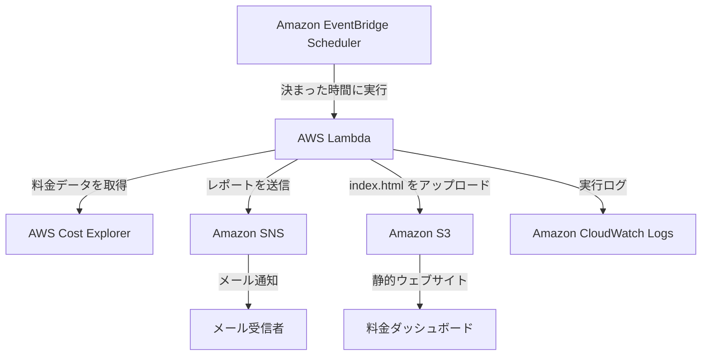

# アーキテクチャ説明

[English](README.md) | 日本語

このドキュメントでは、**AWS Cloud Cost Monitoring and Alert System** の構成について説明します。このシステムは、AWS の利用料金データを自動で取得し、HTML ダッシュボードを作成して、料金レポートをメールで送信します。

## システム構成



## 使用する AWS サービス

| サービス | 役割 |
|---|---|
| Amazon EventBridge Scheduler | 設定したスケジュールに合わせて Lambda 関数を自動で実行します。 |
| AWS Lambda | 料金データの取得と比較、HTML ダッシュボードの作成、レポートの送信を行います。 |
| AWS Cost Explorer | AWS サービスごとの利用料金と使用量のデータを提供します。 |
| Amazon SNS | 作成した料金レポートを、登録済みのメールアドレスへ送信します。 |
| Amazon S3 | 作成した `index.html` を保存し、静的ウェブサイトとして公開します。 |
| Amazon CloudWatch Logs | Lambda の実行結果やエラーを記録し、確認や問題解決に使用します。 |
| AWS IAM | Lambda がほかの AWS サービスを使うために必要な権限だけを設定します。 |

## 処理の流れ

1. EventBridge Scheduler が、設定した時間に Lambda 関数を実行します。
2. Lambda は AWS Cost Explorer から次のデータを取得します。
   - 現在の7日間の料金
   - 前の7日間の料金
   - 今月の初日から現在までの料金
   - AWS サービスごとの料金
3. Lambda は現在と前の期間を比較し、料金が増えたサービスを確認します。
4. Lambda は新しい HTML ダッシュボードを作成します。
5. Lambda はダッシュボードを `index.html` として S3 バケットへアップロードします。
6. Lambda は料金のまとめを SNS トピックへ送信します。
7. SNS は登録を確認したメールアドレスへレポートを送信します。
8. CloudWatch Logs は Lambda の実行ログを保存します。

## IAM 権限

Lambda の実行ロールには、最小権限の考え方を使っています。次のアクションに対する権限が必要です。

```text
ce:GetCostAndUsage
s3:PutObject
sns:Publish
logs:CreateLogGroup
logs:CreateLogStream
logs:PutLogEvents
```

できる場合は、S3 バケットと SNS トピックを必要なリソースだけに制限します。このリポジトリには、アクセスキー、シークレットキー、AWS アカウント ID、個人のメールアドレスを保存しません。

## リージョン

このプロジェクトの主なリソースは、次のリージョンに作成しています。

```text
us-east-1（米国東部・バージニア北部）
```

AWS Cost Explorer は、AWS アカウント全体の料金データを提供します。Lambda、SNS、EventBridge、S3、CloudWatch Logs は、必要に応じてこのプロジェクトのリージョンで管理します。

## ダッシュボードに表示する情報

作成したダッシュボードには、次の情報を表示します。

- 現在の7日間の合計料金
- 前の7日間の合計料金
- 今月の初日から現在までの合計料金
- 2つの期間の料金差
- 料金が増えた AWS サービス
- レポートを作成した時間

Lambda が正常に終了するたびに、ダッシュボードは新しい内容に更新されます。

## 監視と安定した運用

- Lambda のエラーと確認用メッセージは CloudWatch Logs に記録されます。
- Lambda のテスト結果で、レポート作成が正常に終了したか確認できます。
- SNS のメールを受信するには、メールに届く登録確認を完了する必要があります。
- EventBridge Scheduler を使うため、手動で Lambda を実行する必要はありません。
- S3 には、最後に作成したダッシュボードが保存されます。

## セキュリティについて

- IAM 実行ロールには、必要な権限だけを設定します。
- AWS の認証情報、一時トークン、アカウント ID、個人のメールアドレスを GitHub にアップロードしません。
- スクリーンショットを GitHub にアップロードする前に、重要な情報を隠します。
- S3 の公開アクセスは、ダッシュボードに必要な範囲だけにします。
- 実際の業務で使う場合は、S3 バケットを直接公開せず、CloudFront と Origin Access Control を使って非公開にする方法が安全です。

## 現在のプロジェクト範囲

このプロジェクトは、中級レベルの AWS ポートフォリオとして作成しました。現在は、料金レポートの自動作成、メール通知、静的ダッシュボード、実行ログの保存ができます。

今後は、AWS Organizations への対応、異常な料金の検出、CloudFront、ログイン機能、Infrastructure as Code（IaC）などを追加できます。
