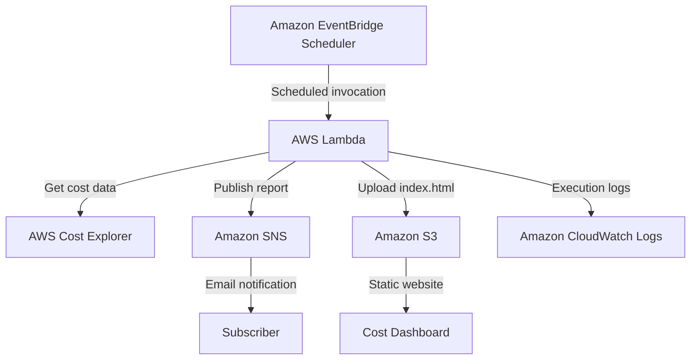
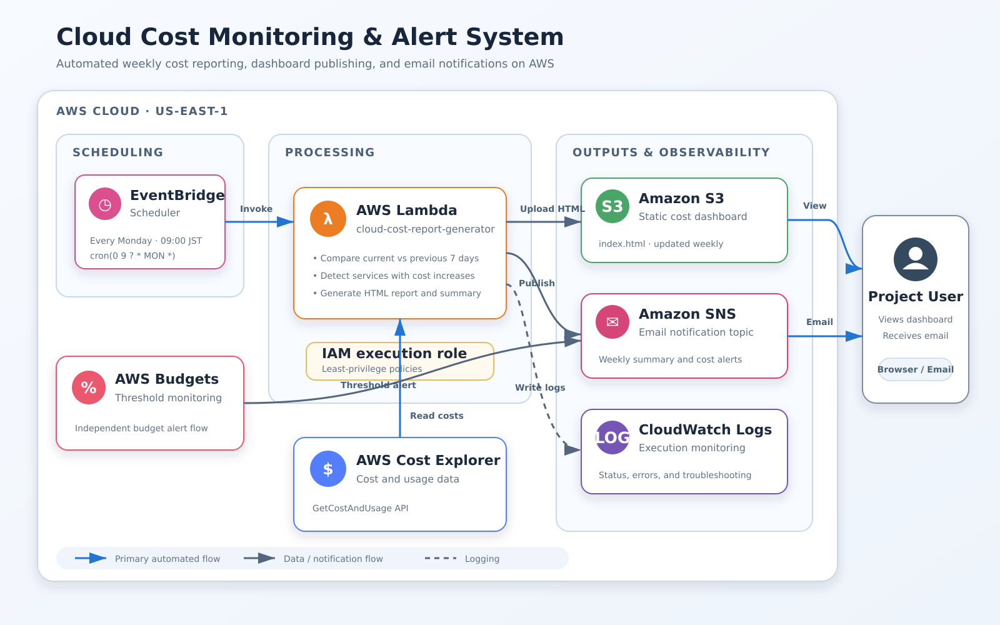

# Architecture Documentation

This document describes the architecture of the **AWS Cloud Cost Monitoring and Alert System**. The system automatically collects AWS cost data, generates a static HTML dashboard, and sends a cost summary by email.

## Architecture Overview


## Architecture Diagram


## AWS Services

| Service | Responsibility |
|---|---|
| Amazon EventBridge Scheduler | Invokes the Lambda function automatically according to the configured schedule. |
| AWS Lambda | Retrieves cost data, compares reporting periods, generates the HTML dashboard, and publishes the report. |
| AWS Cost Explorer | Provides cost and usage data grouped by AWS service. |
| Amazon SNS | Sends the generated cost report to a confirmed email subscriber. |
| Amazon S3 | Stores and hosts the generated `index.html` dashboard. |
| Amazon CloudWatch Logs | Records Lambda execution details, results, and errors for monitoring and troubleshooting. |
| AWS IAM | Grants the Lambda function only the permissions required to access the other services. |

## Execution Flow

1. EventBridge Scheduler invokes the Lambda function at the configured time.
2. Lambda requests the following data from AWS Cost Explorer:
   - Current seven-day cost
   - Previous seven-day cost
   - Month-to-date cost
   - Cost grouped by AWS service
3. Lambda compares the current and previous reporting periods and identifies services with increased costs.
4. Lambda generates a new static HTML dashboard.
5. Lambda uploads the dashboard as `index.html` to the S3 bucket.
6. Lambda publishes a summary message to the SNS topic.
7. SNS sends the report to the confirmed email subscriber.
8. CloudWatch Logs stores the Lambda execution logs for verification and troubleshooting.

## IAM Permissions

The Lambda execution role follows the principle of least privilege. It requires permissions for the following actions:

```text
ce:GetCostAndUsage
s3:PutObject
sns:Publish
logs:CreateLogGroup
logs:CreateLogStream
logs:PutLogEvents
```

Permissions should be restricted to the required S3 bucket and SNS topic wherever resource-level permissions are supported. No access keys, secret keys, account IDs, or personal email addresses are stored in this repository.

## Region

The main project resources are deployed in:

```text
us-east-1 (N. Virginia)
```

AWS Cost Explorer provides account-level cost data. The Lambda function, SNS topic, EventBridge schedule, S3 bucket configuration, and CloudWatch logs used by this project are managed from the selected project region where applicable.

## Dashboard Output

The generated dashboard displays:

- Current seven-day total cost
- Previous seven-day total cost
- Month-to-date total cost
- Cost difference between reporting periods
- AWS services with increased costs
- Report generation time

The dashboard is regenerated whenever the Lambda function completes successfully.

## Reliability and Monitoring

- Lambda failures and diagnostic messages are recorded in CloudWatch Logs.
- The Lambda test result verifies whether the report generation process completed successfully.
- SNS requires email subscription confirmation before notifications can be delivered.
- EventBridge Scheduler automates report generation without manual Lambda invocation.
- S3 retains the most recently generated dashboard file.

## Security Considerations

- Use an IAM execution role with least-privilege permissions.
- Do not commit AWS credentials, temporary tokens, account IDs, or personal email addresses.
- Redact sensitive information from screenshots before uploading them to GitHub.
- Restrict S3 public access to the minimum required for the dashboard design.
- For a production system, prefer private S3 access through CloudFront with Origin Access Control instead of directly exposing the bucket.

## Current Scope

This project is designed as an intermediate-level AWS portfolio project. The current implementation provides automated cost reporting, email notification, a static dashboard, and execution logging. Possible future improvements include AWS Organizations support, anomaly detection, CloudFront distribution, authentication, and infrastructure as code.
